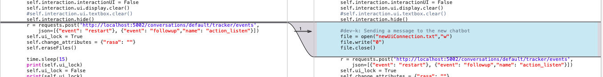
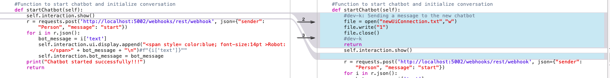
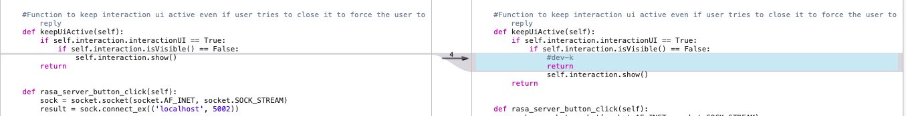
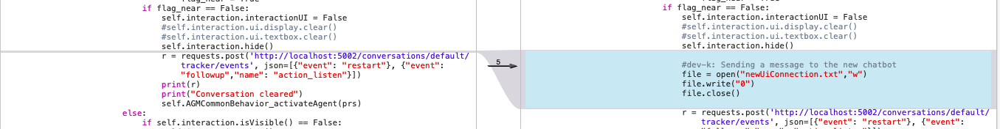
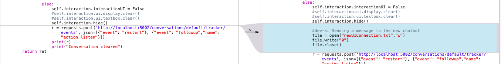

# Handling chat


Communicating with RASA server is easy. It is as simple as sending regular network requests.

After going through `$ROBOCOMP/components/robocomp-viriato/components/conversationalAgent/src/specificworker.py`, I could make out three important requests:


### Network communication

#### 1. Send message

Response empty when already stopped

**Endpoint:**

```
Method: POST
Type: RAW
URL: http://localhost:5002/webhooks/rest/webhook
```

**Body:**

```
{"sender": "Person", "message": "Hello"}
```


#### 2. Start conversation

response empty when already started

**Endpoint:**

```
Method: POST
Type: RAW
URL: http://localhost:5002/webhooks/rest/webhook
```

**Body:**

```
{
    "sender": "Person",
    "message": "start"
}
```


#### 3. Stop conversation

response empty when already stopped

**Endpoint:**

```
Method: POST
Type: RAW
URL: http://localhost:5002/webhooks/rest/webhook
```

**Body:**

```
{"sender": "Person", "message": "stop"}
```


**Available Variables:**

| Key       | Value                                       | Type |
| --------- | ------------------------------------------- | ---- |
| localhost | http://localhost:5002/webhooks/rest/webhook |      |


### Chat Handler


So to handle all things chat, I created a file with `class ChatData`.

We import required communication mechanisms:

In `src/chatData.js`:

```javascript
const {URLProvider, execute} = require("./comm");
const {sendPostRequest} = require("./comm");
```


Next, some data we need to persist:

```javascript
class ChatData {
    static waitingForResponse = false;
    static chatBegun = false;
    static appState;
    //type: Message
    static chatMessages = [];
}
```


`chatMessages` stores entire chat history, for when user moves to a different page and comes back.

`chatBegun` indicates whether a chat is in progress.


Next, I defined class for storing chat messages. This was going to be useful later on to view other details about a particular message, like language, timestamp, sender, etc.


In `src/chatData.js`:

```javascript
const SENDER_BOT=0, SENDER_PERSON=1, SENDER_UNKNOWN=-1;
class Message {
    messageType = SENDER_UNKNOWN;
    content = "";
    timestamp = "";
    senderLabel = "";
    message = "";
    static createNewMessage(message) {
        return {
            "sender":"Person",
            "message":message
        }
    }

    constructor(messageType, content) {
        this.messageType = messageType;
        this.content = content;
        this.timestamp = Date.now();
        if(messageType === SENDER_BOT){
            this.senderLabel = "Robot";
            this.message = this.content.text;
            logv(this.message);
        }else if(messageType === SENDER_PERSON){
            this.senderLabel = "Person";
            this.message = content.message;
        }else{
            this.message = content;
        }
    }
}
```


Now sending and receiving messages was easy. For that, `class ChatData` houses a single communication function.

In `src/chatData.js`:

```javascript
static async sendChatMessage(text) {
        let body = Message.createNewMessage(text);
        this.addNewMessage(new Message(SENDER_PERSON,body));
        let response = await sendPostRequest(URLProvider.messageUrl,body);

        if(response.isError){
            alert('Sending message failed');
        }else{
            //received a valid response. Counting messages
            let messageCount = response.body.length;
            if(messageCount>0){
                for (let mess of response.body){
                    let message = new Message(SENDER_BOT,mess);
                    Speaker.speak(message.message);
                    this.addNewMessage(message);
                }
            }else{
                //construct a message
                let message = new Message(SENDER_UNKNOWN,"No response received");
                this.addNewMessage(message);
            }
        }
    }
```


As soon as a message is sent and received, I have to update the UI and chat history. Since no messages can be sent or received when the chat window is open, my life was a little easier. This is because messages I recieve are simply responses to the messages I send.

So to send a message:

- Accept message content, and convert it into a message object
- Send a request
- Read response and convert it into a message object
- Store both message objects in chat history
- Show both message objects in chat UI

Next, I had to store and retrieve chat history whenever user moved to a different page.

Storage is done every time app a message is added to history.

In `src/chatData.js`:

```javascript
 static saveChatMessageHistory() {
        //get any other changes that happened first
        this.appState = getAppState();
        //set the changes this class makes
        this.appState.chatHistory = this.chatMessages;
        setAppState(this.appState);
    }
```


Retrieval is done every time the page opens.

In `src/chatData.js`:

```javascript
static getChatMessageHistory() {
        this.appState = getAppState();
        AppState.getChatState();
        this.chatMessages = this.appState.chatHistory;
    }
```


## Starting and stopping

Finally, the most important part of this exchange is knowing when to start and stop the chat. When the robot detects a block, it would trigger start chat. And when the block is cleared, it would trigger stop chat.

This is handled by:

`$ROBOCOMP/components/robocomp-viriato/components/conversationalAgent/src/specificworker.py`

Current logic worked just fine, so I wanted to add a simple trigger that would let my app know what the status of chat is. 

So I started writing a single integer to a file at:

`$ROBOCOMP/components/robocomp-viriato/components/conversationalAgent/newUIConnection.txt`

`0` when the conversation should be stopped.

`1` when the conversation should run.

Here is the diff between old and new `specificworker.py`:
















When the chat window is active, `newUIConnection.txt` is read continuously to listen for chat state events.


In `src/chatData.js` (class `ChatData`):

```js
static initChatSync() {
        let syncTimer = setInterval(this.syncChatState, 5000);
    }
```

Triggers chat state read every 5 seconds.


```js
static async syncChatState() {
        await AppState.getChatState();
        if(AppState.chatState === ChatData.chatBegun){
        }else{
            if(AppState.chatState){
                await ChatData.startChat();
            }else{
                ChatData.chatBegun = false;
            }
        }
    }
```

Looks for changes in app state, and takes appropriate action.


When chat is not running, but needs to start, `startChat()` function is called.

In `src/chatData.js` (class `ChatData`):

```js
    static async startChat() {
        let response = await sendPostRequest(URLProvider.messageUrl,Message.createNewMessage("start"));
        if(response.isError){
            alert('starting a chat with conversational agent failed.');
            ChatData.chatBegun = false;
        }else{
            ChatData.chatBegun = true;
            logv('received a valid response. Counting messages');
            let messageCount = response.body.length;
            if(messageCount>0){
                for (let mess of response.body){
                    let message = new Message(SENDER_BOT,mess);
                    this.addNewMessage(message);
                    Speaker.speak(message.message);
                }f
            }else{
                //construct a message
                let message = new Message(SENDER_UNKNOWN,"No response received");
                this.addNewMessage(message);
            }
        }
        this.insertStartChatButton();
    }
```

This function sends a message to the RASA server with content "start".

This starts the conversation with the RASA server.

