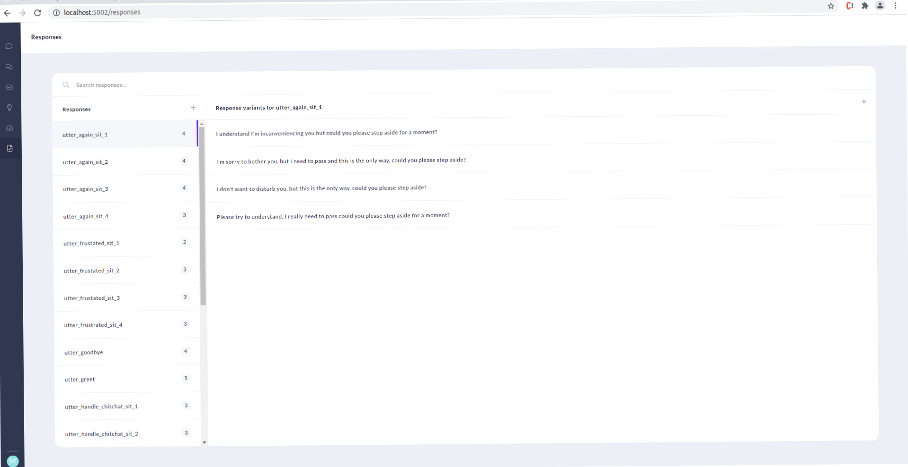
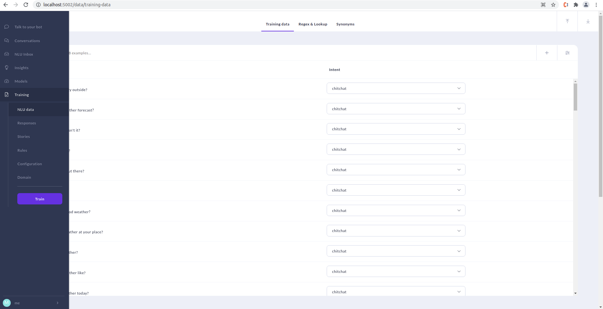
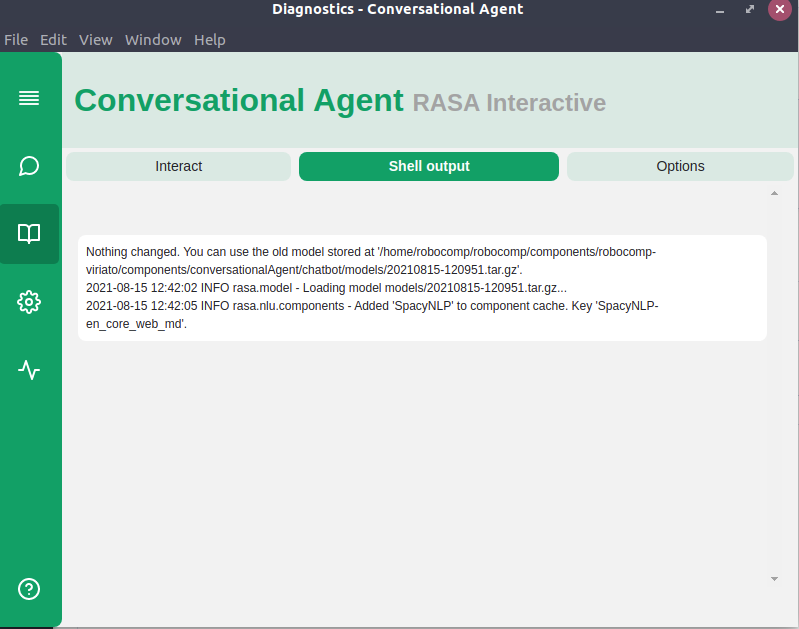
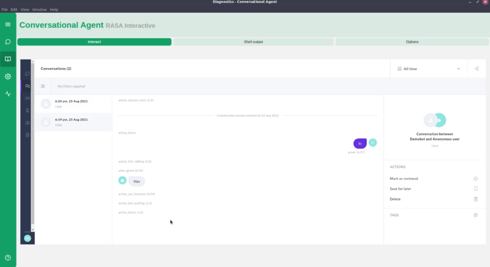

# Rasa Interactive

My mentor showed me how to use rasa interactive and asked me to integrate it in the app.

After getting a hang of how it works, I created a complete UI for RASA interactive.
Then I wrote a node wrapper to control it from the app.
But when I started testing I realised something.

In Rasa interactive I observed 3 stages:

1. trains models
2. Builds and prints configuration
3. Interaction begins

My node wrapper could get all the output of stage 1 correctly, and show it in the shell section of the app.
But it was sending all this output in the `STDERR` pipe, which is not a problem, since my wrapper could read that stream too.

But for stages 2 and 3 I don't understand what stream rasa uses, cause I got no output in any of the pipes. I implemented all events that node's `child_process` provides, I also tried different types of child processes:

- a forked process with Inter process communication
- spawn
- exec
- execFile

But nothing worked. I would never get the output terminal console would get. There was another problem with rasa interactive I wasn't sure how I would solve. It takes input from arrow keys to navigate its options. I was not sure how I would send across those keys using `utf8` encoded `STDIN`.

I finally started reading more about rasa interactive, and trynig to find out how it's implemented, when I stumbled upon Rasa x.

It looked beatiful and suited our needs. So I asked my mentor if it is okay to embed rasa x inside this new app, he said yes.

#### Rasa X

So since we coudn't go ahead with our current plan of rasa interactive, I turned my attention to rasa x
After reading about rasa x, I realised there is a compatibility matrix
I installed the right version of `rasa x 0.24.8` (which was very old since we are using `rasa 1.6.1`), and it did not work. It threw some errors, and when I looked for answers, everyone was talking about newer versions of `rasa x`.

So I decided to try to upgrade rasa. I upgraded rasa to the latest 2.8.2, and tried to run interactive, it said I needed to retrain my model. When I tried retraining, it said there was a problem with spacy. So taking my mentor's advice, I got a newer configuration from the repo, and the configuration solved my spacy error. But it started saying it can't find the right spacy. The error was very ambiguous.
But thankfully it also printed the code that was throwing the error. So I went through the code and realised it also picks up which spacy model to use from the configuration, and simply generates a string. (This is very dangerous, and this error is not even handled. RASA should do something about this.)
Nevertheless, I found the right syntax to define spacy model name, and added it to the configration.

**Side note**
I also submitted a pull request to robocomp-viriato repo so that people training with newer versions of rasa don't face this error: https://github.com/robocomp/robocomp-viriato/pull/4

This solved the problem and the model started training. Training on my laptop took 5 hours, I left it overnight.
In the morning, when I ran rasa x again, it threw newer errors I didn't understand. People with similar problems downgraded to rasa 2.6.2, and that solved their problem. So I did the same thing, and installed the right rasa x by looking up the compatibiltiy matrix

I had to train the model again 😭. 5 hours later, rasa x gave problems that looked like migration errors. I couldn't find a solution online, as the error contained a lot of autogenerated data specific only to my config. It was a hard thing to google. But luckily I noticed rasa x generates rasa.db and events.db if they don't exist, so I tried removing those files and that error was solved. This means that it stores version info in these DBs and simply fails if there is a version conflict. (This is another error RASA needs to handle better.)

For one final problem, rasa x couldn't initialise due to errors with `sanic`. So I tried looking up and updated to a compatible version of sanic, but this didn't solve the problem. Thankfully someone had the exact same problem 1 day ago!
They solved it by installing `sanic-jwt` package. My problem was solved by doing the same thing, and finally, rasa x worked.

Fig: RASA X in browser

Fig: RASA X in browser

Fig: RASA X shell output embedded in conversational agent

Fig: RASA X embedded in conversational agent
