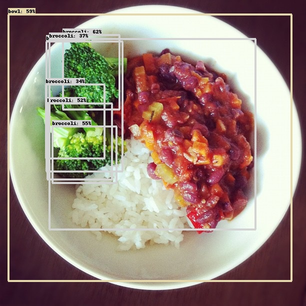
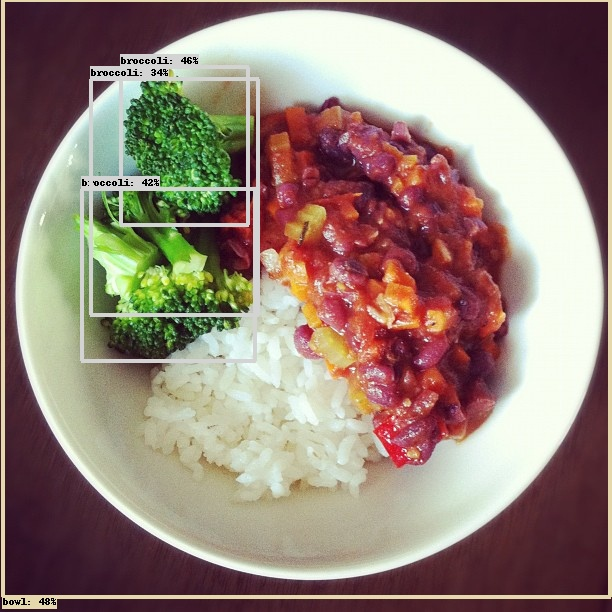

# Testing the Tensorflow Lite models

_16 July, 2021_

## Introduction

In the first phase of the project we have evaluate the models based on statistical parameters before converting them to tflite model, 
in that phase only three models passed so these were converted. Now, we need to evaluate these models in tflite format and this time is going to be more visual, 
in other words, the boxes, classes and scores predicted for the model are going to be drawing in the original to observe if they are working properly in this format.

## Script

To do these tests I have made a Python script that you need to pass an image to get another image with the boxes drawed.
For these to work you need tensorflow 2, cv2, numpy and from the object detection API of Tensorflow the utils. Also, if you want to change the model you must modify **MODEL_FILE** to the name of the model that you are going to use.

    from sys import argv

    import tensorflow as tf
    from cv2 import imread, resize, imwrite
    from numpy import expand_dims, float32, array, copy, uint32
    from utils import visualization_utils

    # Name of the model to use
    MODEL_FILE: str = 'model_efficient.tflite'

    # Directory where the models are located
    MODELS_DIRECTORY: str = 'models_tflite'

    LABELS: list = ['person',
                    'bicycle',
                    'car',
                    'motorcycle',
                    'airplane',
                    'bus',
                    'train',
                    'truck',
                    'boat',
                    'traffic light',
                    'fire hydrant',
                    'street sign',
                    'stop sign',
                    'parking meter',
                    'bench',
                    'bird',
                    'cat',
                    'dog',
                    'horse',
                    'sheep',
                    'cow',
                    'elephant',
                    'bear',
                    'zebra',
                    'giraffe',
                    'hat',
                    'backpack',
                    'umbrella',
                    'shoe',
                    'eye glasses',
                    'handbag',
                    'tie',
                    'suitcase',
                    'frisbee',
                    'skis',
                    'snowboard',
                    'sports ball',
                    'kite',
                    'baseball bat',
                    'baseball glove',
                    'skateboard',
                    'surfboard',
                    'tennis racket',
                    'bottle',
                    'plate',
                    'wine glass',
                    'cup',
                    'fork',
                    'knife',
                    'spoon',
                    'bowl',
                    'banana',
                    'apple',
                    'sandwich',
                    'orange',
                    'broccoli',
                    'carrot',
                    'hot dog',
                    'pizza',
                    'donut',
                    'cake',
                    'chair',
                    'couch',
                    'potted plant',
                    'bed',
                    'mirror',
                    'dining table',
                    'window',
                    'desk',
                    'toilet',
                    'door',
                    'tv',
                    'laptop',
                    'mouse',
                    'remote',
                    'keyboard',
                    'cell phone',
                    'microwave',
                    'oven',
                    'toaster',
                    'sink',
                    'refrigerator',
                    'blender',
                    'book',
                    'clock',
                    'vase',
                    'scissors',
                    'teddy bear',
                    'hair drier',
                    'toothbrush',
                    'hair brush']

    def insert_str(string: str, str_to_insert: str, index: int) -> str:
        return string[:index] + str_to_insert + string[index:]

    if __name__ == "__main__":

        if len(argv) == 2:

            # Convert the labels to the format used by the function that draws the detections
            category_index: dict = {i: {"id": i, "name": LABELS[i]} for i in range(len(LABELS))}

            # Select the resolution of the image according to the model that we are going to use
            RESOLUTION_IMAGE: tuple
            if MODEL_FILE == "model_centernet.tflite":
                RESOLUTION_IMAGE = (320, 320)
            elif MODEL_FILE == "model_efficient.tflite":
                RESOLUTION_IMAGE = (448, 448)
            elif MODEL_FILE == "model_ssd.tflite":
                RESOLUTION_IMAGE = (300, 300)

            # Read the model
            interpreter: tf.lite.Interpreter = tf.lite.Interpreter(MODELS_DIRECTORY + "/" + MODEL_FILE)
            interpreter.allocate_tensors()

            # Getting the input and output tensors
            input_details: list = interpreter.get_input_details()
            output_details: list = interpreter.get_output_details()

            # Load the image and adjust it to the model that we are going to use, also save the original resolution
            image: array = imread(argv[1])
            original_image: array = copy(image)

            # Do the preprocessing according to the model, Efficient Det works with uint8 and does not need any
            # preprocessing, while the others need the values in the range [-1,1]
            if MODEL_FILE != "model_efficient.tflite":
                image = (2.0 / 255.0) * image - 1.0
                image = image.astype(float32)
            image = resize(image, dsize=RESOLUTION_IMAGE)
            image = expand_dims(image, axis=0)

            # Use the model to get the predictions
            interpreter.set_tensor(input_details[0]['index'], image)
            interpreter.invoke()

            # Get the output of the model
            boxes: array = interpreter.get_tensor(output_details[0]['index'])
            classes: array = interpreter.get_tensor(output_details[1]['index'])
            scores: array = interpreter.get_tensor(output_details[2]['index'])
            num_predictions: int = int(interpreter.get_tensor(output_details[3]['index'])[0])

            print(boxes)
            print(classes)
            print(scores)

            # Draw the boxes with their corresponding label and score
            image = visualization_utils.visualize_boxes_and_labels_on_image_array(
                original_image,
                boxes[0],
                classes[0].astype(uint32),
                scores[0],
                category_index,
                use_normalized_coordinates=True,
                min_score_thresh=0.3
            )

            # Finally, save the image with the detections
            imwrite(insert_str(argv[1], "_detect", argv[1].index('.')), image)
            print("The image has been saved")

        else:
            print('You must specify the filename of the image '
                  'that you want to use like this "python test_detection.py IMAGE_DIRECTORY'

## Results

### SSD MobileNet

The results of this model are pretty decent respect to the requirements needed

### Efficient Det

As in the last model the results are good

### CenterNet 

In this case, the results do not reach the expectatives. For a minimum score of 0.3 all predictions are below this score so I reduce this minimum to 0.12 and the results not make sense.

__Alejandro Fernández Camello__
