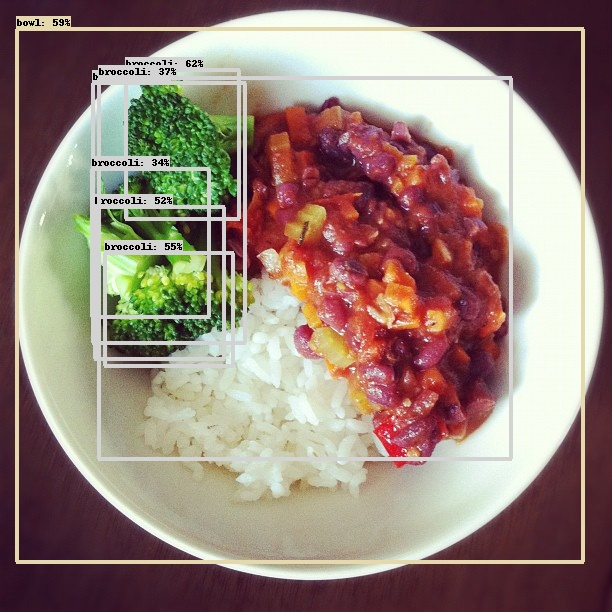
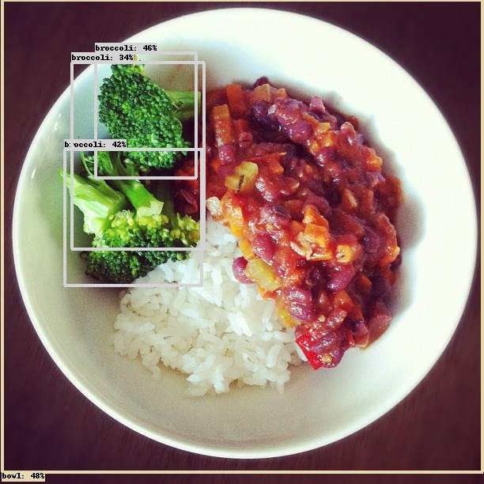
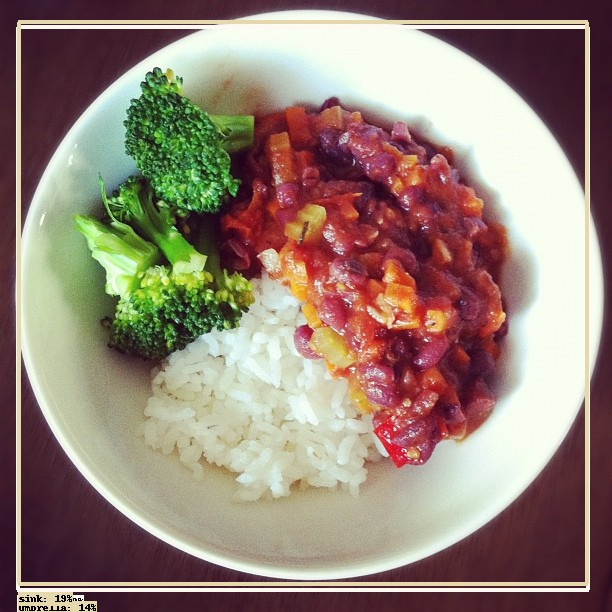

# Creating the component and adding an extra test

_26 July, 2021_

## Introduction

The goal of the previous week was to create the component, that has been done easily using the [RoboComp](https://github.com/robocomp/robocomp) command robocompdsl and having a good reference in emotionrecognition2 component previously create made things easier.

## Creating the component

Firstly, I need to locate the interface that I have previously created in my robocomp installation in the directory interfaces/IDSLs, also I have done some changes in the interfaces to modify and get the threshold (if the confidence of the prediction is lower than the threshold it will not be included in the predictions) and change the string class in Sprediction to label as class is a keyword in Python. So the final code of the interface will be like that:

    module DetectionComponent
    {
        struct SPrediction
        {
            int x;
            int y;
            int w;
            int h;
            string label;
        };

        sequence<SPrediction> Predictions;

        sequence<byte> ImgType;

        struct TImage
        {
            int width;
            int height;
            int depth;
            ImgType image;
        };

        interface DetectionComponent
        {
            Predictions processImage(TImage frame);
            void setThreshold(float threshold);
            float getThreshold();
         };
    };
    
After that, I need to execute the following command with the cdsl file in the directory of the component:

    robocompdsl DetectionComponent.cdsl .

With the code generated I only need to write the methods of the interface in the specificworker.py generated by robocompdsl, also I will need to read the model in the constructor of SspecificWorker as is not a good idea to open it each time an image is processed.

### Constructor:

    def __init__(self, proxy_map, startup_check=False):
        super(SpecificWorker, self).__init__(proxy_map)
        self.Period = 2000

        # Set a default threshold
        self.threshold = 0.3

        # Read the model
        self.interpreter: tf.lite.Interpreter = tf.lite.Interpreter("../models/model_efficientdet.tflite")
        self.interpreter.allocate_tensors()

        # Get the input and output tensors
        self.input_details: list = self.interpreter.get_input_details()
        self.output_details: list = self.interpreter.get_output_details()

        if startup_check:
            self.startup_check()
        else:
            pass

### Interface methods:

    # =============== Methods for Component Implements ==================
    # ===================================================================

    #
    # IMPLEMENTATION of getThreshold method from DetectionComponent interface
    #
    def DetectionComponent_getThreshold(self):
        return self.threshold

    #
    # IMPLEMENTATION of processImage method from DetectionComponent interface
    #
    def DetectionComponent_processImage(self, frame):
        predictions = list()
        try:
            # Convert the bytes of the image to a tensor with shape (width,height,3) RGB
            arr = np.fromstring(frame.image, np.uint8)
            frame = np.reshape(arr, (frame.width, frame.height, frame.depth))
            frame = cv2.cvtColor(frame, cv2.COLOR_BGR2RGB)

            # Preprocess the image
            frame = cv2.resize(frame, dsize=(448, 448))
            frame = np.expand_dims(frame, axis=0)

            # Execute the interpreter
            self.interpreter.set_tensor(self.input_details[0]['index'], frame)
            self.interpreter.invoke()

            # Get the outputs of the model
            boxes: np.array = self.interpreter.get_tensor(self.output_details[0]['index'])
            classes: np.array = self.interpreter.get_tensor(self.output_details[1]['index'])
            scores: np.array = self.interpreter.get_tensor(self.output_details[2]['index'])
            num_predictions: int = int(self.interpreter.get_tensor(self.output_details[3]['index'])[0])

            # Prepare the data according to the interface
            for i in range(num_predictions):
                if scores[i] > self.threshold:
                    prediction = SPrediction()
                    prediction.x = int(boxes[i][0] * frame.height)
                    prediction.y = int(boxes[i][1] * frame.width)
                    prediction.w = int((boxes[i][2]-boxes[i][0]) * frame.height)
                    prediction.h = int((boxes[i][3]-boxes[i][1]) * frame.width)
                    prediction.label = LABELS[int(classes[i])]
                    predictions.append(prediction)

        except Ice.Exception as e:
            traceback.print_exc()
            print(e)
        finally:
            return predictions

    #
    # IMPLEMENTATION of setThreshold method from DetectionComponent interface
    #
    def DetectionComponent_setThreshold(self, threshold):
        self.threshold = threshold

    # ===================================================================
    # ===================================================================

## Results

### SSD MobileNet

The results of this model are pretty decent respect to the requirements needed

### Efficient Det

As in the last model the results are good

### CenterNet 

In this case, the results do not reach the expectatives. For a minimum score of 0.3 all predictions are below this score so I reduce the minimum to 0.12 and the results do not make sense.

I tried converting the model another time to check if the fault was about a bad conversion from the original model, but the results did not improve.

### Conclusion

After these evaluations we can conclude that SSD MobileNet and Efficient Det are the best options, meanwhile CenterNet does not work properly converted to tflite in this case. I think that the predictions of Efficient Det are a tiny better compared with SSD Mobile, so Efficient Det will be the model used in the component.

__Alejandro Fernández Camello__

