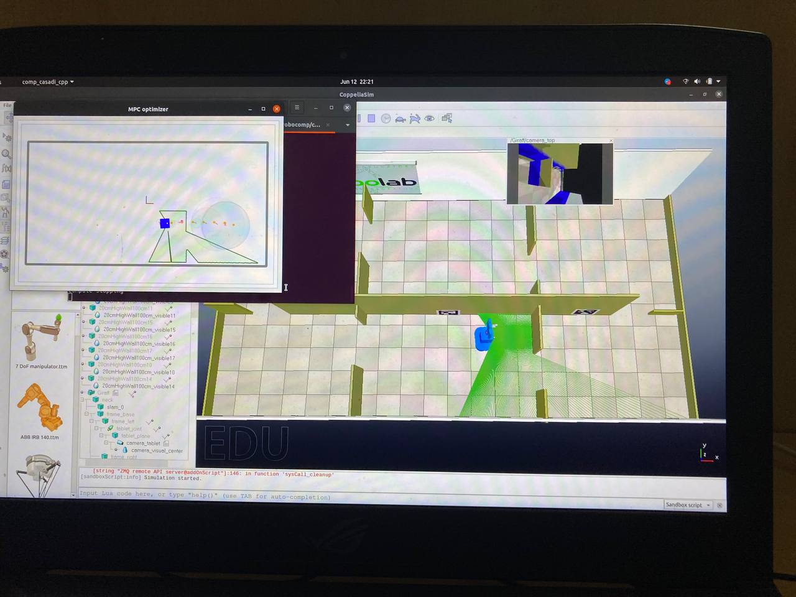

# GSoC'22 RoboComp project: Model Predictive Control for obstacle avoidance 

22nd June 2022

## Phase 1 

Phase 1 started from June 13th. The plan for the phase 1 is to review, correct
and test the existing MPC algorithm.

I started with the **comp-casadi-cpp** component. It had the free-ball
implementation of MPC. 

I tested the algorithm in three different environments: 1. run_beta_bill, 2.
run_beta_bill_walking and 3. run_beta_infirmary. In all of these environments
the trajectory is failing to avoid collisions and is passing right through the
obstacles.

### Result of free-balls trajectory passing through the walls

After fiddling with the weights of the cost function and making sure all the
constraints were implemented properly, we concluded that we need specific points
that we can consider in the occupied set to make the freeballs algorithm work. 

Then I moved on to analyzing the **local_grid** component. Here after setting a
target, a path is calculated using the A\* algorithm. After that we follow the
path using either the carrot algorithm or the MPC. 

### Testing the MPC algorithm with static obstacles

1. One of the problem with the MPC was it didn't have any acceleration
   constraints. As a result the velocities would jump arbitrarily and was
   leading to erratic behaviors like suddenly moving very very slowly when it is
   near the obstacles. I fixed this by adding the acceleration constraints to
   the MPC so that there is a smooth change in the velocity of the MPC. [Pull
   request \#3](https://github.com/robocomp/optimizer/pull/3)

2. The path generated by the A\* algorithm is avoiding obstacles and since the
   MPC is simply following that path, it is able to avoid all the static
   obstacles. However the point of failure for the MPC algorithm is if the
   target is given inside an obstacle, the A\* path planner generates a path
   that leads inside the obstacle and since the MPC is following that path, it
   eventually goes and crashes with that obstacle. To solve this issue I made
   use of the local grid. I know which of the grid cells is occupied and which
   of them are free. Using this information I formulated the obstacle avoidance
   constraints considering each occupied cell as an obstacle. However if I take
   all the cells into consideration the number of constraints will be large in
   number and the optimization process will be slower. To avoid that I only
   considered the obstacles which are within a distance of 5m to the robot. I
   also set the minimum velocity as -0.2 m/sec so that the robot can move in the
   reverse direction is necessary. A slight modification to the cost function
   was also made. Initially we were minimizing the distance of the MPC generated
   trajectory to the reference trajectory. However this would force the MPC
   trajectory to overlap with the reference trajectory even if it is in the
   obstacle. To solve that, in the current cost function I am simply minimizing
   the first 6 positions of the MPC trajectory to the reference trajectory.
   After making these changes now the agent is working properly in environments
   with static obstacles. If the target is given within an obstacle then the MPC
   simply keeps moving around the obstacle instead of crashing into it. [Pull
   request \#4](https://github.com/robocomp/optimizer/pull/4)

### Video of the corrected MPC in the environment run_beta_bill

