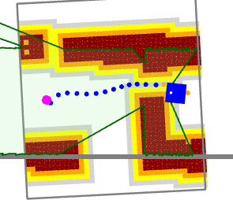

# GSoC'22 RoboComp project: Model Predictive Control for obstacle avoidance 

08 September 2022

## Phase 2

The phase 2 started from July 25th. The plans for phase 2 are:
1. Introduce a feature where if the target is given inside an obstacle, the
   target will automatically be moved to the nearest unoccupied cell.
2. We discoreved a problem where the agent is unable to pass through narrow
   corridors. This bug needs to be fixed.
3. Re-formulating the obstacle avoidance constraints as free-balls [ [Paper] ](
   https://arxiv.org/abs/1909.08267 ) and implement that as a constraint in the
   MPC.

## Contribution 1: Move target if it is in occupied cell

During our testing in phase-1, I observed that if the target is given inside an
occupied cell, the MPC tries to move towards it as one of the cost function of
the MPC is to minimize the distance between the robot position and the goal
position. This often leads to the robot crashing as it reeached near the
obstacle. To fix this issue I first checked if the target and all it's
neighbouring cells are unoccupied. If even one of the neighbouring 16 cells of
the target is occupied, I consider the target to be inside a occupied cell and
move the target to the nearest free cell available. 

The following code snippet is taking care of this:

```C++
if(neighboors_16(target).size()<16){
      std::optional<QPointF> new_target = closest_free(target_);
      target = pointToKey(new_target->x(), new_target->y());
      std::cout<<"OCCUPIED"<<std::endl;
 }
```
In the video [ [Target in obstacle] ]( https://youtu.be/mq_63IHb0MQ ), you can
see how the robot performs when the target is given in an obstacle. Before
fixing this issue, the robot used to crash but now the robot no longer crashes.
It goes near the obstacle and stops. [ [Pull Request #379] ](
https://github.com/robocomp/robocomp/pull/379 ) 

## Contribution 2: Passing through narrow corridors

Another problem I found during my phase-1 testing period was that with the
euclidean distance obstacle avoidance constraints, the robot can't pass through
narrow corridors. The below image shows that the occupied cells in the map are
marked overconservatively. In the image, the green lines represent the actual
obstacle boundaries.



Because of this overconstrained representation of the obstacles, the MPC was
unable to come up with a feasible trajectory that can take the robot across the
corridors. Currently this was happening because given an occupied cell, all it's
16 neighbouring cells were also marked as obstacles. I fixed this my marking the
8 neighbouring cells as obstacles instead of 16. 

The below code snippet does is taking care of this:

```C++
for (auto &&[k, v]: iter::filterfalse([](auto v) { return std::get<1>(v).free; }, fmap))
{
    v.cost = 100;
    v.tile->setBrush(occ_brush);
    for (auto neighs = neighboors_8(k); auto &&[kk, vv]: neighs)
    {
        fmap.at(kk).cost = 100;
        fmap.at(kk).tile->setBrush(occ_brush);
    }
}
```

In the video [ [Passing through narrow corridors] ](
https://youtu.be/1x6ngcrBRds ), you can see that the robot can now pass through
the narrow corridors with the euclidean distance obstacle avoidance constraints.
We can also observe that the obstacles are now represented in a much less
conservative way.
[ [Pull Rrequest #379] ]( https://github.com/robocomp/robocomp/pull/379 ) 
